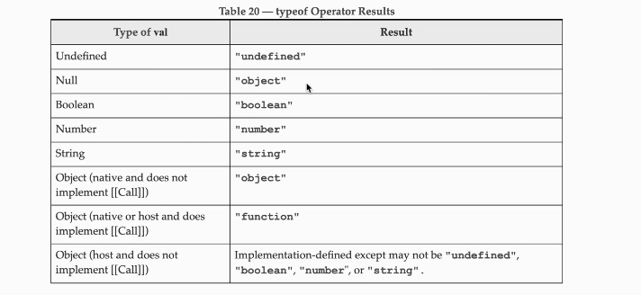

# Variables

const accountId = 450                   // cannot be changed
let accountMail = "akki@gmail.com"      // can be changed 
var accountPass = "12345"               // can be changed
accountCity = "Pune"                    // Allowed

* Don't use var 
because of issue in block scope and functional scope
- let and const provides block scope but var dont have block scope so dont use it 

let accountState;
- now accountState is undefined

# Datatypes

"use strict"  // if we use this it means that treat all js code as newer version of code 

**Primitive**

1. Number 
2. string
3. boolean
4. null             // typeof(null) = object        (null is object)
5. undefined        // typeof(undefined) = undefined
6. symbol           // to make any value unique
7. BigInt

**Reference Type**

1. Array
2. Objects
3. Functions

* Javascript is Dynamically typed checked language (means no need to mention data type )

# Conversion

const score = "35abc"

console.log(typeof score);          // string

let valueInNumber = Number(score)

console.log(typeof valueInNumber)   // number

console.log(valueInNumber);     // NaN (not a number)

* If we try to convert null to Number we get 0

* If we convert true to number then its 1 , false is 0 , "" is 0 , "abc" is 1

let num = 45;
let str = String(num);   // converting to string

* let value = 5;
let nValue = -value;
console.log(value);

console.log("1"+2);     // 12
console.log("1"+2+2);   // 122

console.log(1+2+"2")    // 32

* console.log(null > 0)     // false
* console.log(null == 0)    // false
* console.log(null >= 0)    // true  (bcz when we use >= then our null is converted to 0)

* console.log(undefined == 0)   // false
* console.log(undefined > 0)    // false
* console.log(undefined < 0)    // true

=== (strict type checking)

* console.log("2" == 2)         // true
* console.log("2" === 2)        // false

* const id = Symbol('123')
* const anotherId = Symbol('123')

* console.log(id === anotherId)     // false

* Array : 

const heros = ["Iron man" , "Thor" , "Hulk"]

* Objects :

const heros = {
    name : "Thor",
    city : "nyc",
    country : "usa",
}

# Memory

- stack and heap

- primitive datatypes = Stack
- reference datatypes = Heap

let userName = "harry";
let naam = userName;

naam = "chaiwala";

console.log(userName)   // harry
console.log(naam)       // chaiwala (even if we change name the username dont change)

let user1 = {
    name : "shankar",
    City : "pune"
}

let user2 = user1;

user2.City = "dhule";

console.log(user1.city)     // dhule
console.log(user2.city)     // dhule (if we change user2 then user1 values also changes bcz user2 addressing at same object as user1 , any change in user2 reflect on user1)

* String Writing New Syntax

const name = "harry";
const roll = 22;
console.log(`Hello my name is ${name} and my roll no is ${roll})

- const gameName = "hitesh" 

const newString = gameName.substring(0,4);      // hite (4 not included )

const otherString = gameName.slice(0,4);

(whats difference in slice and substring)

- const name = "   harry    ";
console.log(name)                   // __harry__
console.log(name.trim())            // harry

